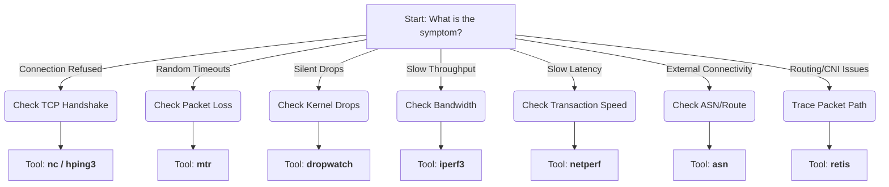

# 🥷 Net-Kunai


**The Network Ninja's Multi-Tool for Kubernetes & OpenShift**

**Net-Kunai** is a specialized, lightweight container image designed to be a "Swiss Army Knife" for network engineers, SREs, and developers debugging complex networking issues in Kubernetes, OpenShift, and Linux environments.

It combines low-level kernel diagnostic tools (like `dropwatch` and `retis`) with OSINT/Lookup utilities (`asn`) and standard performance testers (`iperf3`, `netperf`).

---

## 📦 Tool Inventory & Sources

This image mixes tools compiled from the latest source (for bleeding-edge features) with stable enterprise packages.

| Tool | Source | Version Notes | Check Command |
| :--- | :--- | :--- | :--- |
| **Dropwatch** | 🏗 Compiled | Latest Git `HEAD` | `dropwatch -v` |
| **Retis** | 🐳 Official | Extracted from `quay.io/retis/retis` | `retis --version` |
| **ASN** | 📥 Download | Latest Script | `asn --version` |
| **Iperf3** | 🏗 Compiled | Latest Git `HEAD` (Static Build) | `iperf3 -v` |
| **Netperf** | 🏗 Compiled | Latest Git `HEAD` | `netperf -V` |
| **Uperf** | 🏗 Compiled | Latest Git `HEAD` | `uperf -V` |
| **k8s-netperf** | 🏗 Compiled | Latest Git `HEAD` (Go) | `k8s-netperf --help` |
| **OC Client** | 📥 Download | OpenShift v4 Stable | `oc version` |
| **Kubectl** | 📥 Download | Kubernetes Stable | `kubectl version --client` |
| **Tcpdump** | 📦 RPM | AlmaLinux 9 / AppStream | `tcpdump --version` |
| **Hping3** | 📦 RPM | EPEL 9 | `hping3 -v` |
| **WireGuard** | 📦 RPM | EPEL 9 | `wg --version` |
| **Sshuttle** | 📦 RPM | EPEL 9 | `sshuttle --version` |
| **Bmon** | 📦 RPM | EPEL 9 | `bmon -v` |
| **Iftop** | 📦 RPM | EPEL 9 | `iftop -h` |

---

## ⚡ Quick Start (Pre-built One-Liner)

If you don't want to build anything or use YAML files, you can run the pre-built image directly from Quay using this one-liner.

> [!NOTE]
> This command uses JSON overrides to grant the necessary `privileged` security context and `hostNetwork` access required for network debugging.

**OpenShift (OCP):**
```bash
oc run net-kunai --rm -it --image=quay.io/rh_ee_mlecki/net-kunai:latest --restart=Never --overrides='{"spec": {"hostNetwork": true, "hostPID": true, "securityContext": {"privileged": true}}}' -- /bin/bash

```

**Vanilla Kubernetes:**

```bash
kubectl run net-kunai --rm -it --image=quay.io/rh_ee_mlecki/net-kunai:latest --restart=Never --overrides='{"spec": {"hostNetwork": true, "hostPID": true, "securityContext": {"privileged": true}}}' -- /bin/bash

```

---

## 🚀 Full Deployment (Robust Method)

For deep debugging (specifically for **Dropwatch** and **Retis**), you must mount the host's `/proc` and `/sys` directories. The one-liner above cannot easily do this, so use this manifest method for full capabilities.

### Step 1: Create Identity & Permissions

First, create a `ServiceAccount` and grant it the necessary privileges.

**OpenShift (OCP):**

```bash
oc create sa net-kunai
oc adm policy add-scc-to-user privileged -z net-kunai

```

**Vanilla Kubernetes:**
*(Ensure your namespace allows privileged pods)*

```bash
kubectl create sa net-kunai

```

### Step 2: Deploy the Pod

Copy the following YAML to a file named `net-kunai.yaml` and apply it.

**Note on `/host/proc`:** We explicitly mount the host's proc filesystem to `/host/proc` to allow tools like `dropwatch` to resolve kernel symbols.

```yaml
apiVersion: v1
kind: Pod
metadata:
  name: net-kunai
  labels:
    app: net-kunai
spec:
  serviceAccountName: net-kunai
  hostNetwork: true
  hostPID: true
  nodeSelector:
    kubernetes.io/os: linux
  containers:
  - name: net-kunai
    image: quay.io/rh_ee_mlecki/net-kunai:latest
    imagePullPolicy: Always
    command: ["/bin/bash", "-c", "sleep infinity"]
    securityContext:
      privileged: true
      capabilities:
        add: ["NET_ADMIN", "SYS_ADMIN", "SYS_PTRACE", "SYSLOG"]
    volumeMounts:
    # Mount host proc to resolve kernel symbols (kallsyms)
    - name: host-proc
      mountPath: /host/proc
      readOnly: true
    - name: modules
      mountPath: /lib/modules
      readOnly: true
    - name: sys
      mountPath: /sys
      readOnly: true
    - name: boot
      mountPath: /boot
      readOnly: true
  volumes:
  - name: host-proc
    hostPath:
      path: /proc
      type: Directory
  - name: modules
    hostPath:
      path: /lib/modules
      type: Directory
  - name: sys
    hostPath:
      path: /sys
      type: Directory
  - name: boot
    hostPath:
      path: /boot
      type: Directory

```

**Apply it:**

```bash
oc apply -f net-kunai.yaml

```

### Step 3: Enter the Dojo

Attach to the shell to start troubleshooting.

```bash
oc rsh net-kunai
# OR if rsh is not interactive enough:
oc exec -it net-kunai -- /bin/bash

```

> [!TIP]
> You are now inside the node's network namespace with full root privileges. Be careful!

### Step 4: Cleanup

When you are finished, delete the pod and the service account.

```bash
oc delete pod net-kunai
oc delete sa net-kunai

```

---

## 🧭 Troubleshooting Decision Map

Not sure which tool to use? Follow this flow.



| Symptom | Primary Suspect | **Use This Tool** |
| --- | --- | --- |
| **"Connection Refused"** | Firewall / App Down | `nc` or `hping3` |
| **Random Timeouts** | Packet Loss | `mtr` |
| **"Silent" Drops** | Kernel/Driver Drops | `dropwatch` |
| **Slow Throughput** | Bandwidth Limit | `iperf3` |
| **Slow Request/Response** | Latency / Jitter | `netperf` |
| **Unknown Traffic Hog** | Noise / DDoS | `iftop` |
| **CNI / Routing Weirdness** | Routing Table / BPF | `retis` |
| **External Route/ISP** | BGP / Reputation | `asn` |
| **Restricted Network** | Private Subnet | `sshuttle` |

---

## 🛠 Building the Image (Optional)

If you prefer to build the image yourself instead of using the pre-built one.

### Standard Build (Linux/Intel)

```bash
podman build -t quay.io/rh_ee_mlecki/net-kunai:latest .

```

### Cross-Compile (Apple Silicon M1/M4 -> AMD64)

> [!NOTE]
> If you are on a Mac building for an Intel/AMD cluster, you **must** use the platform flag.

```bash
podman build --platform linux/amd64 -t quay.io/rh_ee_mlecki/net-kunai:latest .

```

---

## 🧰 Detailed Tool Usage

### 1. Intelligence & Reconnaissance

<details>
<summary><b>ASN</b> (Click to expand)</summary>

**Best For:** Investigating external IP addresses, checking AS (Autonomous System) paths, and ISP reputation.

```bash
# Lookup an IP (Returns ASN, Organization, Reputation)
asn 8.8.8.8

# Lookup an Organization
asn Google

```

</details>

<details>
<summary><b>Tcpdump</b> (Click to expand)</summary>

**Best For:** Verifying packet arrival on an interface.

```bash
# Capture port 80 traffic, no DNS resolution (-n), verbose (-v)
tcpdump -i any port 80 -nn -v

```

</details>

### 2. Kernel Forensics

<details>
<summary><b>Dropwatch</b> (Click to expand)</summary>

**Best For:** Finding "silent" packet drops that tcpdump can't explain.

**Important:** You must link the host's `kallsyms` for names to resolve correctly.

```bash
# 1. Link host symbols (Required because container runtimes mask /proc)
ln -sf /host/proc/kallsyms /proc/kallsyms

# 2. Initialize with Kernel Address Space lookup
dropwatch -l kas

# 3. Start monitoring
> start

```

</details>

<details>
<summary><b>Retis</b> (Click to expand)</summary>

**Best For:** Visualizing the full path of a packet through OVS, iptables, and the kernel.

```bash
# Trace all dropped packets
retis collect -e drops

# Trace traffic to a specific pod IP
retis collect -f "ip.daddr == 10.128.2.50"

```

</details>

### 3. Performance & Stress Testing

<details>
<summary><b>Iperf3</b> (Click to expand)</summary>

**Best For:** Testing raw bandwidth (Gbps).

```bash
# Server Mode (Run this on Node A)
iperf3 -s

# Client Mode (Run this on Node B)
iperf3 -c <node_a_ip>

```

</details>

<details>
<summary><b>Netperf</b> (Click to expand)</summary>

**Best For:** Testing latency and transaction speed (Requests Per Second).

```bash
# Test Transaction Rate (Request/Response)
netperf -H <target_ip> -t TCP_RR

```

</details>

### 4. Utilities & Connectivity

* **`sshuttle`**: VPN into a private subnet via a jump host.
```bash
sshuttle -r user@bastion.example.com 10.0.0.0/24

```


* **`wg`**: Debug WireGuard tunnels.
```bash
wg show

```


* **`socat`**: Port forwarding or connecting data streams.
```bash
socat TCP-LISTEN:8080,fork TCP:google.com:80

```


* **`mtr`**: Diagnosing packet loss at specific network hops.
```bash
mtr 8.8.8.8

```